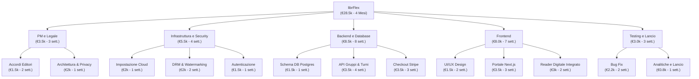

# **librFlex**

**Autore:** Diego D'Ortenzio

## **Legenda e Navigazione**

1. **[Descrizione e Visione](#descrizione)**
2. **[Analisi di Mercato](#problema)** (Problema, Target, Competitors)
3. **[Specifiche Tecniche](#tecnologie)**
4. **[Analisi dei Requisiti](#analisi-dei-requisiti)** (Dettagli, Elenco e User Stories)
5. **[Modellazione e Prototipazione](#use-case-uml)** (UML e Prototipo)
6. **[Business Strategy](#elevator-pitch-e-business-model)** (Pitch, Business Model e WBS)

---

## **Descrizione:**
Una piattaforma digitale dove i lettori possono **acquistare insieme i libri**, dividendo la spesa in modo semplice e trasparente. Ogni utente può poi **leggere il libro a turno**, lasciando recensioni non solo sull’opera, ma anche sugli altri lettori con cui ha condiviso l’acquisto.
Un modo innovativo, collaborativo e sostenibile di accedere alla lettura: **meno costi, più condivisione, più scoperta**.

> ✨ *Niente abbonamenti, niente vincoli: solo libri, persone e storie che si incontrano.*

---

## **Problema**

L'ostacolo principale identificato nel mercato attuale è il seguente:

> L’eccessivo costo dell’acquisto di libri, sia in versione online che in versione fisica.

---

## **Target**

Il servizio si rivolge specificamente a:
Lettori appassionati che vogliono leggere **ovunque**, senza pesi e a un prezzo conveniente.

---

## **Competitors**

Il panorama attuale offre diverse alternative, ma nessuna focalizzata sul modello di acquisto collettivo proposto da librFlex:

* Kobo Plus
* Kindle Unlimited
* Bookelot
* Anobii

### **Analisi Comparativa**

| 🧩 **Caratteristica** | ⭐ **Importanza** | 📚 **LibrFlex (P.)** | 📘 **Kobo Plus** | 📗 **Kindle Unlimited** | 📙 **Bookelot** | 💬 **Anobii** |
| --- | --- | --- | --- | --- | --- | --- |
| **Acquisto condiviso** | 🔥 High | 🟢 **Disponibile** – Gruppi di conoscenti o sconosciuti con recensioni tra co-lettori | 🔴 Non disponibile | 🔴 Non disponibile | 🔴 Non disponibile | 🔴 Solo catalogazione (nessun accesso diretto) |
| **Accesso illimitato a migliaia di libri** | 🔥 High | 🟢 Tutti i libri acquistati in gruppo, lettura a turno | 🟢 Ampio catalogo selezionato | 🟠 Solo parte del catalogo incluso | 🔴 Pochi libri a catalogo | 🔴 Solo catalogazione |
| **Prezzo basso e accessibile** | 🔥 High | 🟢 Costo condiviso (molto ridotto) | 🟢 €9.99/mese | 🟠 €13.99/mese | 🔴 Prezzo variabile e crescente | 🟢 Gratis (funzionalità social) |
| **Aggiornamento mensile del catalogo** | 🔥 High | 🟢 Nuovi titoli mensili (classici + novità) | 🟢 Aggiornato frequentemente | 🟢 Aggiornamenti regolari | 🔴 Catalogo statico | 🟠 Dipende dagli utenti |
| **Suggerimenti in base ai propri gusti** | 🔥 High | 🟢 Basati su recensioni e interazioni | 🔴 Limitato | 🟠 Non sempre accurato | 🔴 Assente | 🟢 Social e partecipativo |
| **Nessuna pubblicità** | 🔥 High | 🟢 Nessuna pubblicità | 🟢 Nessuna | 🟢 Nessuna | 🟢 Nessuna | 🟢 Nessuna |
| **Disponibilità multipiattaforma** (web, mobile, tablet, e-reader) | 🔥 High | 🟢 Tutti i dispositivi | 🟢 Ottimizzato per eReader Kobo | 🟢 App mobile e Kindle | 🔴 Limitato | 🟢 Web e mobile |
| **Possibilità di download offline** | 🟡 Moderate | 🟢 Lettura temporanea protetta | 🟢 Disponibile | 🟢 Disponibile | 🔴 Non previsto | 🔴 Non prevista |
| **Collaborazioni con editori indipendenti o minori** | 🟢 Low | 🟢 Ampio spazio agli indipendenti | 🔴 Pochi | 🔴 Limitati | 🔴 Assenti | 🟢 Supporta piccoli editori |
| **Funzionalità social** (recensioni, interazioni tra utenti) | 🔥 High | 🟢 Recensioni su libri e co-acquirenti | 🟠 Limitate | 🟠 Solo recensioni libri | 🔴 Nessuna | 🟢 Core del servizio (social reading) |

---

## **Tagline**

> “Una storia letta da molti, vissuta da ciascuno. Ridefinisci il modo di leggere, Insieme.”

---

## **Tecnologie**

Per supportare un'architettura così complessa, è stato selezionato uno stack tecnologico moderno e scalabile:

* **Frontend:** Next.js (React) + Tailwind CSS → interfaccia moderna, veloce e responsiva
* **Backend:** Node.js con NestJS o Express → API REST e logica applicativa
* **Database:** PostgreSQL (principale) + Redis (cache e sessioni)
* **Autenticazione:** OAuth 2.0 / JWT con Auth0 o Firebase Auth
* **Pagamenti:** Stripe (Stripe Connect per gestione quote e split payment)
* **Storage e distribuzione:** Amazon S3 + Cloudflare CDN
* **Antipirataggio:** DRM (Adobe / Google Widevine) + watermark dinamico + accesso via streaming protetto
* **Hosting e cloud:** AWS o Google Cloud (scalabilità e affidabilità)
* **Sicurezza:** HTTPS, crittografia AES, bcrypt per password, 2FA opzionale
* **Monitoraggio e analytics:** Sentry (errori) + Google Analytics o Mixpanel (uso e engagement)
* **CI/CD e versioning:** GitHub + GitHub Actions per deployment automatici

---

## **Analisi dei Requisiti**

## **Descrizione dei requisiti**

La piattaforma di lettura condivisa è un servizio online che consente agli utenti di **registrarsi**, accedere tramite **login sicuro** e recuperare la password in caso di smarrimento. Ogni utente autenticato può gestire il proprio **profilo personale** e utilizzare le funzionalità principali del sistema (funzionale).

Gli utenti possono **cercare libri**, consultarne i dettagli, leggere tramite il **lettore digitale integrato** e avere la **sincronizzazione automatica delle letture** su tutti i dispositivi (funzionale). La sincronizzazione viene attivata automaticamente durante l’attività di lettura.
La piattaforma permette inoltre di **creare gruppi di acquisto condiviso**, scegliendo tra **gruppi pubblici** (aperti a tutti) o **gruppi privati** (accesso su invito o approvazione). Ogni utente può anche **partecipare ai gruppi** creati da altri, visualizzando le condizioni e la **quota di partecipazione** (funzionale), ed **interagendo in essi**.

Una volta definita la quota, il sistema attiva la procedura di **checkout dei pagamenti**, integrata con il **Sistema Bancario**, responsabile dell’autorizzazione e validazione delle transazioni (funzionale). Solo dopo il pagamento avvenuto correttamente il libro digitale viene reso disponibile ai partecipanti.

Gli utenti possono inoltre **recensire i libri** letti e **recensire i gruppi** ai quali hanno partecipato, contribuendo al sistema di reputazione interno (funzionale).

Gli amministratori accedono tramite un **login con privilegi elevati**, che consente loro la **gestione del catalogo**, comprendente l’aggiunta, aggiornamento o rimozione dei libri. Ogni operazione sul catalogo richiede la **verifica dei diritti editoriali** e delle licenze tramite l’attore esterno **Editore** (funzionale).

L’interfaccia deve essere **semplice e intuitiva**, pensata per utenti di qualsiasi livello di competenza tecnologica (non funzionale). La piattaforma deve garantire **tempi di risposta rapidi**, disponibilità continua e **compatibilità multipiattaforma** (non funzionale).
Il sistema deve essere **scalabile**, strutturato in modo modulare e facilmente manutenibile (non funzionale), senza contenuti pubblicitari (non funzionale).
Tutti i libri sono soggetti al rispetto dei **diritti d’autore** e delle licenze editoriali formalizzate con gli editori (di dominio). Il modello economico si basa sull’**acquisto condiviso**, con ripartizione automatica dei costi e **pagamenti sicuri** tramite integrazione bancaria (di dominio).
La protezione dei contenuti è garantita tramite **DRM**, **watermark dinamici**, e il pieno rispetto delle norme sulla privacy e degli standard di accessibilità (WCAG) (di dominio).

---

## **Elenco Riassuntivo Requisiti**

### **Funzionali**

* Registrazione, login e recupero password
* Gestione del profilo utente
* Ricerca dei libri nel catalogo
* Lettura tramite lettore digitale e sincronizzazione dei progressi
* Creazione di gruppi di acquisto (pubblici o privati)
* Partecipazione ai gruppi di acquisto
* Comunicazione tra i membri di un gruppo tramite chat interna
* Gestione delle quote di partecipazione
* Checkout dei pagamenti con integrazione al sistema bancario
* Recensioni su libri e gruppi
* Accesso sicuro per le funzionalità d'amministrazione
* Gestione del catalogo da parte dell’amministratore
* Verifica dei diritti editoriali tramite editore esterno

#### **User Story**

In questa sezione vengono dettagliate le necessità degli utenti attraverso il formato standard delle User Stories:

| **Attore (Come...)**      | **Requisito / Azione (Voglio...)**          | **Beneficio (In modo da...)**                          |
| --- | --- | --- |
| Utente                    | registrarmi alla piattaforma                | creare un account e accedere ai servizi                |
| Utente                    | effettuare il login                        | accedere al mio profilo e alle funzionalità riservate |
| Utente                    | recuperare la password                      | ripristinare l’accesso in caso di smarrimento          |
| Utente                    | gestire il mio profilo                      | aggiornare i dati personali e le configurazioni        |
| Utente                    | cercare un libro nel catalogo              | trovarlo rapidamente tramite filtri e criteri          |
| Utente                    | leggere un libro tramite lettore integrato | accedere comodamente ai contenuti digitali            |
| Utente                    | sincronizzare i miei progressi di lettura  | mantenerli aggiornati su tutti i dispositivi          |
| Utente                    | creare un gruppo di acquisto                | condividere l’acquisto e la lettura con altri utenti  |
| Utente                    | creare un gruppo pubblico                  | permettere a chiunque di partecipare                  |
| Utente                    | creare un gruppo privato                    | limitare l’accesso agli utenti invitati                |
| Utente                    | partecipare a un gruppo di acquisto        | condividere costi e lettura con altri utenti          |
| Utente                    | visualizzare la quota da pagare            | sapere il costo della mia partecipazione              |
| Utente → Sistema Bancario | effettuare il checkout del pagamento        | completare la transazione in modo sicuro              |
| Utente                    | recensire un libro                          | condividere giudizi e valutazioni                      |
| Utente                    | recensire un gruppo                        | valutare l’esperienza di partecipazione                |
| Utente | chattare con i membri del gruppo | coordinare l’acquisto e la lettura    |
| Utente | inviare messaggi nel gruppo      | discutere del libro e dell’esperienza |
| Amministratore            | effettuare il login con privilegi          | accedere alle funzioni amministrative                  |
| Amministratore            | gestire il catalogo dei libri              | aggiungere, modificare o rimuovere contenuti          |
| Amministratore → Editore  | verificare i diritti dei contenuti          | confermare licenze e autorizzazioni editoriali        |

#### **Non Funzionali**

* Interfaccia chiara, accessibile e intuitiva
* Caricamento rapido e tempi di risposta ridotti
* Alta disponibilità e affidabilità del servizio
* Compatibilità multi-piattaforma (web, mobile, tablet, e-reader)
* Scalabilità per gestire un numero crescente di utenti e libri
* Codice modulare e facilmente manutenibile
* Esperienza d’uso priva di pubblicità

#### **Di Dominio**

* Rispetto di diritti d’autore e licenze digitali
* Accordi continuativi con editori e autori per aggiornare il catalogo
* Modello economico basato sull’acquisto condiviso (no abbonamento)
* Integrazione di DRM e watermarking per protezione antipirateria
* Conformità agli standard WCAG e alle normative sulla privacy (GDPR)

---

## **Use Case UML**

Rappresentazione grafica delle interazioni tra gli attori e il sistema:

---

## **Prototipo Basato Sui Requisiti**

Accesso diretto alla versione interattiva della piattaforma: 

---

## **Elevator Pitch e Business Model**

### **Slide Mentali**

#### **Slide 1: The Opening Slide**

* Nome Compagnia: librFlex  
* Progetto: Editoria Digitale e Economia della Condivisione.  
* Contatto: Diego D'Ortenzio – dortenzio.diego.studente@itispaleocapa.it  
* Slogan: "Una storia letta da molti, vissuta da ciascuno."

#### **Slide 2: The Problem** 

Oggi leggere costa troppo. Il prezzo dei libri, sia fisici che digitali, è in costante aumento, limitando l'accesso alla cultura. Molti lettori vorrebbero leggere di più, ma sono frenati dal costo del singolo volume o dai vincoli dei modelli ad abbonamento che spesso non includono le ultime novità.

#### **Slide 3: The Solution** 

librFlex è la prima piattaforma di Social Reading & Group Buying. Permettiamo agli utenti di acquistare libri digitali in gruppo, dividendo il costo. Non è un abbonamento: è un acquisto condiviso dove il libro viene letto a turno dai partecipanti, rendendo la cultura accessibile, legale e sociale.

#### **Slide 4: Market Size** 

Il mercato dell'e-publishing è in crescita costante, con milioni di lettori che si spostano verso il digitale. Solo in Italia, il mercato dei libri vale oltre 1.7 miliardi di euro. librFlex si inserisce nell'intersezione tra l'e-commerce editoriale e la sharing economy, un settore che cresce del 20% ogni anno.

#### **Slide 5: Business Model** 

Operiamo come un Marketplace. Collaboriamo con le case editrici offrendo i loro titoli sul nostro catalogo. Il nostro ricavo deriva da una commissione fissa applicata a ogni acquisto di gruppo. In questo modo, l'editore vende di più, il lettore spende meno e noi scaliamo con ogni gruppo creato.

#### **Slide 6: Proprietary Technology** 

* Architettura Scalabile: Frontend in Next.js e Backend in Node.js per alte prestazioni.  
* Sicurezza e Legalità: Integrazione DRM e Watermarking dinamico per proteggere il copyright degli editori.  
* Split Payment: Integrazione con Stripe Connect per la divisione automatica dei pagamenti tra gli utenti.

#### **Slide 7: Competition** 

I nostri competitor sono colossi come Kindle Unlimited e Kobo Plus, o social network come Anobii. Tuttavia, nessuno di loro offre la proprietà condivisa del libro o l'abbattimento del prezzo d'acquisto tramite gruppi sociali.

#### **Slide 8: Why is librFlex better?**

A differenza degli abbonamenti 'all-you-can-read' che spesso offrono cataloghi limitati o titoli datati, librFlex permette di accedere alle novità editoriali a una frazione del prezzo. Inoltre, il nostro sistema di recensioni tra co-acquirenti trasforma la lettura da attività solitaria in un'esperienza di community.

#### **Slide 9: Customer Acquisition** 

* Social & Community: Partnership con BookToker e Bookstagrammer.  
* Referral: Meccanismi di 'invita un amico' per completare i gruppi di acquisto più velocemente.

#### **Slide 10: Founding Team**

* Diego D'Ortenzio: Founder & Project Lead.

#### **Slide 11: Money, Milestones** 

Il nostro obiettivo per il primo anno è raggiungere i primi 10.000 utenti attivi e stringere accordi con almeno 50 case editrici indipendenti. Prevediamo l’eguagliamento delle spese entro il secondo anno di attività grazie alla bassa spesa di gestione dell'infrastruttura digitale.

---

### **L'Elevator Pitch** 

Ciao, sono Diego D'Ortenzio, fondatore di librFlex. Sapete che il costo elevato dei libri è la prima barriera che allontana i giovani dalla lettura? Abbiamo creato librFlex per abbattere questa barriera. Siamo un marketplace che permette alle persone di acquistare libri insieme, dividendo la spesa e leggendo a turno in modo legale e protetto. A differenza dei classici abbonamenti, con noi paghi solo quello che leggi, risparmiando fino al 70% sul prezzo di copertina. Abbiamo già definito la tecnologia DRM per proteggere gli autori e siamo pronti a trasformare la lettura da un lusso solitario a un'esperienza condivisa. Abbiamo già progettato l'infrastruttura tecnologica con protezione DRM e pagamenti integrati. Oggi cerchiamo un investimento iniziale di 50.000€ per finalizzare gli accordi con le case editrici e lanciare la versione beta sul mercato. Siete pronti a riscrivere insieme a noi il futuro dell'editoria?

---

### **WBS (Work Breakdown Structure)**

Pianificazione dettagliata delle fasi di sviluppo e relativi costi:

